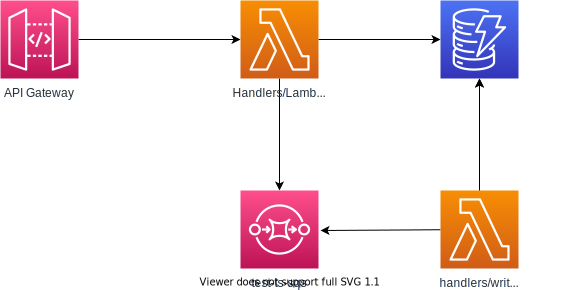

# Type script lambda



<https://levelup.gitconnected.com/how-to-use-typescript-for-aws-lambda-in-3-steps-1996243547eb>

```json
{
    "compilerOptions": {
      "module": "CommonJS",
      "target": "ES2017",
      "noImplicitAny": true,
      "preserveConstEnums": true,
      "outDir": "./built",
      "sourceMap": true
    },
    "include": ["src/**/*"],
    "exclude": ["node_modules", "**/*.spec.ts"]
  }
```

<https://evilmartians.com/chronicles/serverless-typescript-a-complete-setup-for-aws-sam-lambda>

## Running localstack

```bash
// run localstack
podman run --rm -it -p 4566:4566 -p 4571:4571 localstack/localstack

// to use network host
podman run --rm -it -p 4566:4566 -p 4571:4571 --network host localstack/localstack

// to make this run lambda that calls dynamodb
podman run --rm -it -p 4566:4566 -p 4571:4571 localstack/localstack -e DEFAULT_REGION=ca-central-1 -e AWS_DEFAULT_REGION=ca-central-1 -e AWS_SECRET_ACCESS_KEY = "test" -e AWS_ACCESS_KEY_ID = "test" 

podman run --rm -it -p 4566:4566 -p 4571:4571 --network host localstack/localstack -e DEFAULT_REGION=ca-central-1 -e AWS_DEFAULT_REGION=ca-central-1 -e AWS_SECRET_ACCESS_KEY = "test" -e AWS_ACCESS_KEY_ID = "test" 

//check
curl http://localhost:4566/health | jq
```

## packaging

<https://docs.aws.amazon.com/lambda/latest/dg/nodejs-package.html>

```bash
npm run build
cp node_modules dist
zip -r function.zip .
```


## Terraform with local stack

<https://registry.terraform.io/providers/hashicorp/aws/latest/docs/guides/custom-service-endpoints#localstack>

<https://docs.localstack.cloud/integrations/terraform/>

<https://dev.to/mrwormhole/localstack-with-terraform-and-docker-for-running-aws-locally-3a6d>

```bash
cd infra-as-code
terraform init
terraform validate
terraform plan
terraform apply -auto-approve
```

## AWS validate stuff

```bash
aws --endpoint-url=http://localhost:4566 lambda list-functions --profile local
aws --endpoint-url=http://localhost:4566 apigateway get-rest-apis --profile local

//v4xiad2sdy
aws --endpoint-url=http://localhost:4566 apigateway get-rest-api --rest-api-id v4xiad2sdy --profile local

aws --endpoint-url=http://localhost:4566 apigateway get-deployments --rest-api-id v4xiad2sdy --profile local

aws --endpoint-url=http://localhost:4566 apigateway get-deployment --rest-api-id v4xiad2sdy --deployment-id lz0zgwno23 --profile local

aws --endpoint-url=http://localhost:4566 apigateway get-resources --rest-api-id v4xiad2sdy --profile local

//dynamodb
aws dynamodb list-tables --endpoint-url=http://localhost:4566 --profile local

aws dynamodb describe-table --table-name AirlineCarriers --endpoint-url=http://localhost:4566 --profile local

aws dynamodb scan --table-name AirlineCarriers --endpoint-url=http://localhost:4566 --profile local

aws dynamodb get-item --table-name AirlineCarriers --key '{"airlineCode":{"S":"yyz"}}' --endpoint-url=http://localhost:4566 --profile local
```

## tests with curl

```bash
curl -vvvv http://localhost:4566/restapis/v4xiad2sdy/test/_user_request_/

curl -vvvv --header "Content-Type: application/json" --request POST --data '{"airlineCode":"zzz","airlineDisplayName":"display"}' http://localhost:4566/restapis/kn733tt49y/test/_user_request_/

curl -vvvv --header "Content-Type: application/json" --request PUT --data '{"email": "totot@toto.com", "firstName": "titi", "lastName":"titi"}'


//async
curl -vvvv --header "Content-Type: application/json" --request POST --data '{"airlineCode":"zzzfy2","airlineDisplayName":"fy2"}' http://localhost:4566/restapis/g60sucv471/test/_user_request_/?asyncpost=1
```

## logs

```bash
aws --endpoint-url=http://localhost:4566 logs describe-log-groups --profile local

aws --endpoint-url=http://localhost:4566 logs describe-log-streams --log-group-name /aws/lambda/ts-lambda-function --profile local

 aws --endpoint-url=http://localhost:4566 logs get-log-events --log-group-name /aws/lambda/ts-lambda-function --log-stream-name '2022/03/30/[LATEST]cb92877e' --profile local

aws --endpoint-url=http://localhost:4566 logs describe-log-streams --log-group-name /aws/lambda/sqs-lambda-function --profile local

aws --endpoint-url=http://localhost:4566 logs get-log-events --log-group-name /aws/lambda/sqs-lambda-function --log-stream-name '2022/04/05/[1]26062d6a' --profile local


aws --endpoint-url=http://localhost:4566 logs get-log-events --log-group-name /aws/lambda/sqs-lambda-function --log-stream-name '2022/04/05/[1]26062d6a' --profile local


```

## SQS

```bash
aws --endpoint http://localhost:4566 sqs list-queues --profile local

 aws --endpoint http://localhost:4566 sqs send-message --queue-url 
 http://localhost:4566/000000000000/test-ts-sqs --message-body '{"airlineCode":"xyz","airlineDisplayName":"displaxyz"}'
```
